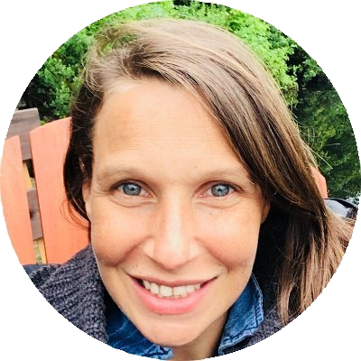
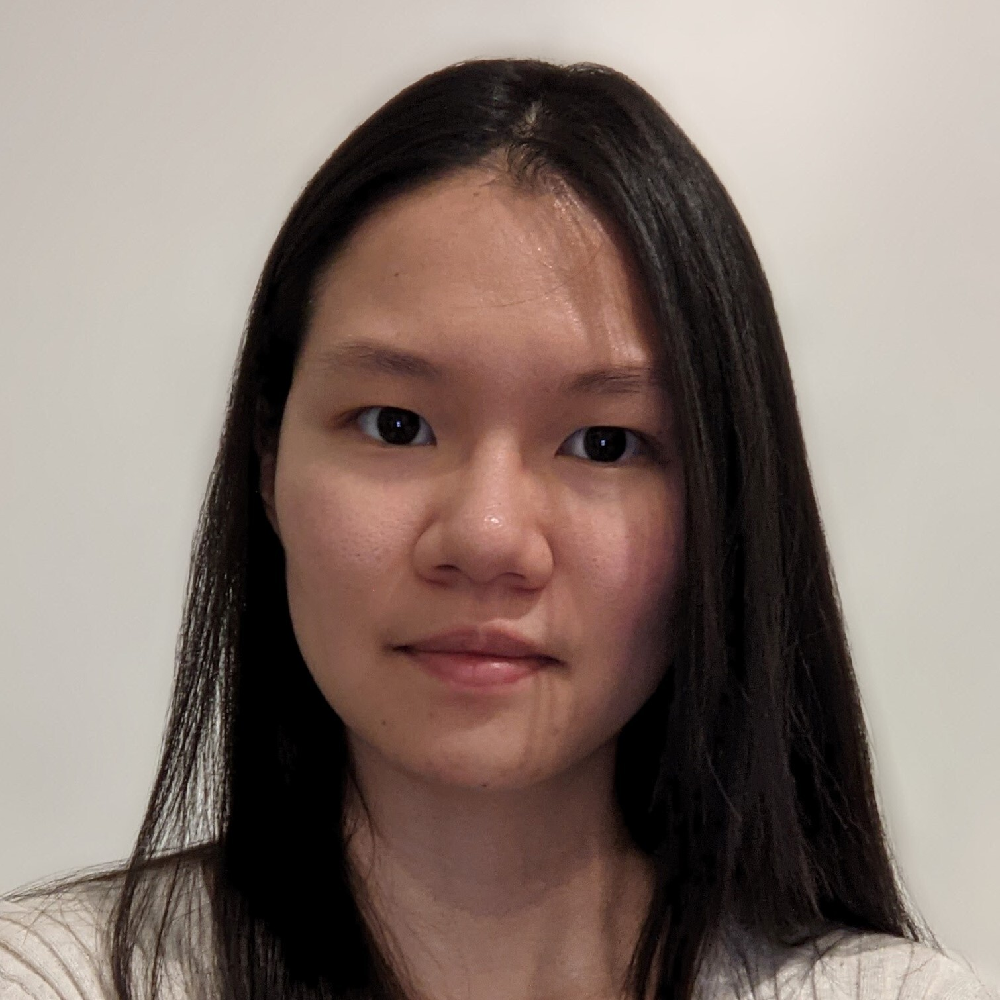

# Members

## Staff

::::{grid}

```{card} Lune Bellec
:header: 
:url: https://github.com/lunebellec

Professor and laboratory director
```

```{card} Julie Boyle
:header: 
:url: https://www.linkedin.com/in/julie-boyle-064b17297/
Project manager
```

```{card} Basile Pinsard
:header: 
:url: https://www.linkedin.com/in/basile-pinsard-94161b8/
Data engineer
```

```{card} Marie St-Laurent
:header: 
:url: https://github.com/MarieStLaurent
Data scientist - _digital brain phantom trainer_
```
::::

## Post-doctoral fellows

::::{grid}

```{card} Hao-Ting Wang
:header: 
:url: https://wanghaoting.com
Post-doctoral fellow - _foundation models for fMRI_
```

```{card} Isil Bilgin
:header: 
:url: https://github.com/complexbrains
Post-doctoral fellow - _brain-aligned large language models_ - co-supervision with Dr Leila Wehbe
```

```{card} Yann Harel
:header: 
:url: https://github.com/hyruuk
Post-doctoral fellow - _brain/behaviour correlates of flow in videogames_ - co-supervision with Dr Karim Jerbi
```


```{card} Elizabeth DuPre
:header: 
:url: https://github.com/emdupre
Post-doctoral fellow - _finding shared functional patterns via alignment techniques_
:::
::::

## PhD students
::::{grid}

```{card} Maëlle Freteault
:header: 
:url: https://github.com/maelleF
Phd student - _personalized auditory brain encoding models_ - co-supervision with Dr Nicolas Farrugia
```

```{card} Maximilien LeClei
:url: https://github.com/MaximilienLC
:header: 
PhD student - _neuroevolution for human alignment in videogames_
```

```{card} Marie-Ève Picard
:url: https://github.com/me-pic
:header: 
PhD student - _physiological correlates of brain/behaviour in videogames_ - co-supervision with Dr Pierre Rainville
```

```{card} Pravish Sainath
:url: https://pravishsainath.wixsite.com/mysite
:header: 
Phd student - _brain alignment in memory models_ - co-supervision with Dr Guillaume Lajoie
```

::::

## Master's students
::::{grid}
```{card} Hugo Delhaye
:url: https://github.com/HugoDelhaye
:header: 
Master's student in psychology - _measuring curiosity in videogames_ - co-supervision with Dr Audrey Durand
```
```{card} Sara Barbu
:url: https://github.com/SaraBarbu  
:header: 
Volunteer intern (also Master's student in psychology) - _The Image10k dataset of natural images_ - co-supervision with Dr Valentina Borghesani
```
::::


## Alumni
 * [**François Paugam**](https://www.linkedin.com/in/françois-paugam-b1835910b/), PhD student (2025) - _brain/behaviour imitation in videogames_ - co-supervision with Dr Guillaume Lajoie
 * [**Sana Ahmhadi**](https://www.linkedin.com/in/sana-ahmadi/), PhD student (2024) - _scaling up brain encoding models with high-performance computing_ - co-supervision with Dr Tristan Glatarad
 * [**Mikkel Schöttner**](https://www.linkedin.com/in/mikkel-schoettner/), PhD student visitor Mitacs internship (2024) - _graph neural network for brain/phenotype association in HCP_.
