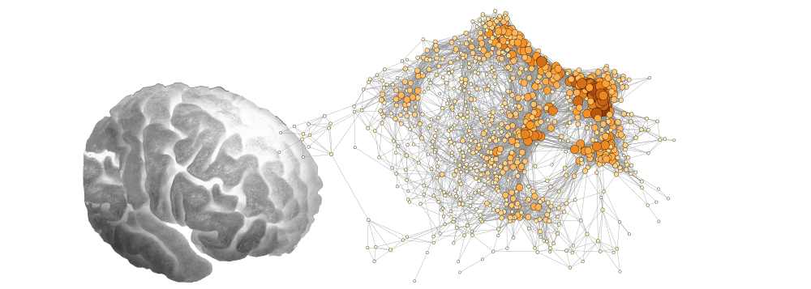
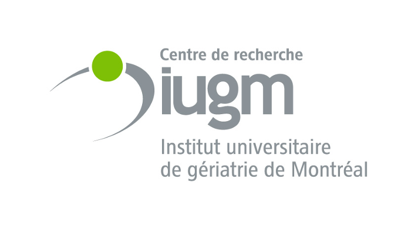

# SIMEXP



The laboratory for brain simulation and exploration (SIMEXP) is located in Montreal and affiliated with the [CRIUGM](https://criugm.qc.ca/), [CSS-MTL](https://ciusss-centresudmtl.gouv.qc.ca/) and [Université de Montréal](https://psy.umontreal.ca/accueil/). The main objective of the lab is to train artificial neural networks in order to jointly mimic individual human brain activity and behaviour, notably leading the Courtois project on neuronal modelling ([CNeuroMod](https://cneuromod.ca)). The SIMEXP lab also translates these models to identify markers of brain disorders using neuroimaging data.

::::{grid}

```{card} CRIUGM
:url: http://www.criugm.qc.ca/en.html
:header: 
Research centre of the Montreal Geriatrics Institute
```

```{card} UdeM
:url: https://psy.umontreal.ca/accueil/
:header: 
Psychology department, University of Montreal
```

```{card} CNeuroMod
:url: https://cneuromod.ca
:header: 
The Courtois project on neuronal modelling
```
::::
