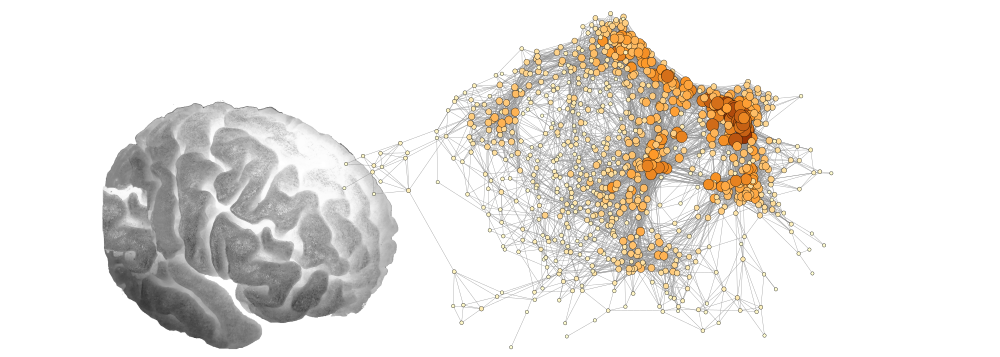

# SIMEXP



The laboratory for brain simulation and exploration (SIMEXP) is located in Montreal and affiliated with the [CRIUGM](https://criugm.qc.ca/), [CSS-MTL](https://ciusss-centresudmtl.gouv.qc.ca/) and [Université de Montréal](https://psy.umontreal.ca/accueil/). The main objective of the lab is to train artificial neural networks in order to jointly mimic individual human brain activity and behaviour, notably leading the Courtois project on neuronal modelling ([CNeuroMod](https://cneuromod.ca)). The SIMEXP lab also translates these models to identify markers of brain disorders using neuroimaging data.

::::{grid}
:::{grid-item}
```{image} ../images/logo_criugm_white.png
:alt: logo criugm
:class: bg-primary mb-1
:height: 120px
:align: center
```
[CRIUGM](https://criugm.qc.ca/en/)
:::

:::{grid-item}
```{image} ../images/logo_udem.png
:alt: logo psy UdeM
:class: bg-primary mb-1
:height: 120px
:align: center
```
[UdeM Psychology Department](https://psy.umontreal.ca/accueil/)
:::

:::{grid-item}
```{image} ../images/logo_neuromod_black.png
:alt: logo CNeuroMod
:class: bg-primary mb-1
:height: 50px
:align: center
```
[CNeuroMod project](https://cneuromod.ca)
:::

::::
