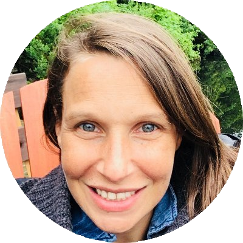

# Members

## Staff

::::{grid}

:::{grid-item-card} Lune Bellec 

Professor and laboratory director
:::

:::{grid-item-card} Julie Boyle
:link: https://www.linkedin.com/in/julie-boyle-064b17297/

Project manager
:::

:::{grid-item-card} Basile Pinsard
:margin: 3
:columns: 12 3 3 3
:class-body: text-center
:link: https://github.com/bpinsard
:img-top: https://avatars.githubusercontent.com/u/1155388?v=4?s=100
Data engineer
:::

:::{grid-item-card} Marie St-Laurent
:margin: 3
:columns: 12 3 3 3
:class-body: text-center
:link: https://github.com/MarieStLaurent
:img-top: https://avatars.githubusercontent.com/u/9339621?v=4
Data scientist - digital brain phantom trainer
:::
::::

## Post-doctoral fellows

::::{grid}

:::{grid-item-card} Hao-Ting Wang
:margin: 3
:columns: 12 3 3 3
:class-body: text-center
:link: https://wanghaoting.com
:img-top: images/profile_haoting.jpg
Post-doctoral fellow - foundation models for fMRI
:::

:::{grid-item-card} Isil Bilgin
:margin: 3
:columns: 12 3 3 3
:class-body: text-center
:link: https://github.com/complexbrains
:img-top: images/profile_isil.jpg
Post-doctoral fellow - brain-aligned large language models - co-supervision with Dr Leila Wehbe
:::

:::{grid-item-card} Yann Harel
:margin: 3
:columns: 12 3 3 3
:class-body: text-center
:link: https://github.com/hyruuk
:img-top: images/profile_yann.jpg
Post-doctoral fellow - brain/behaviour correlates of flow in videogames - co-supervision with Dr Karim Jerbi
:::

:::{grid-item-card} Elizabeth DuPre
:margin: 3
:columns: 12 3 3 3
:class-body: text-center
:link: https://github.com/emdupre
:img-top: https://avatars.githubusercontent.com/u/15017191?v=4
Post-doctoral fellow - finding shared functional patterns via alignment techniques
:::
::::

## PhD students
::::{grid}

:::{grid-item-card} Sana Ahmhadi
:margin: 3
:columns: 12 3 3 3
:class-body: text-center
:link: https://www.linkedin.com/in/sana-ahmadi/
:img-top: images/profile_sana.jpg
Phd student - scaling up brain encoding models with high-performance computing - co-supervision with Dr Tristan Glatarad
:::

:::{grid-item-card} Maëlle Fréteault
:margin: 3
:columns: 12 3 3 3
:class-body: text-center
:link: https://github.com/maelleF
:img-top: https://avatars.githubusercontent.com/u/29599311?v=4
Phd student - personalized auditory brain encoding models - co-supervision with Dr Nicolas Farrugia
:::

:::{grid-item-card} Maximilien LeClei
:margin: 3
:columns: 12 3 3 3
:class-body: text-center
:link: https://github.com/MaximilienLC
:img-top: images/profile_maximilien.jpg
PhD student - neuroevolution for human alignment in videogames
:::

:::{grid-item-card} Marie-Ève Picard
:margin: 3
:columns: 12 3 3 3
:class-body: text-center
:link: https://github.com/me-pic
:img-top: https://avatars.githubusercontent.com/u/77584086?v=4
PhD student - physiological correlates of brain/behaviour in videogames - co-supervision with Dr Pierre Rainville
:::

:::{grid-item-card} Pravish Sainath
:margin: 3
:columns: 12 3 3 3
:class-body: text-center
:link: https://pravishsainath.wixsite.com/mysite
:img-top: https://avatars.githubusercontent.com/u/13696562?v=4
Phd student - brain alignment in memory models - co-supervision with Dr Guillaume Lajoie
:::

:::{grid-item-card} Xanthy Lajoie
:margin: 3
:columns: 12 3 3 3
:class-body: text-center
:link: https://github.com/Xanthylajoie
:img-top: images/profile_xanthy.jpg
Phd student - sex effects on language functional connectivity - co-supervision with Dr Simona Brambati
:::
::::

## Master's student
::::{grid}
:::{grid-item-card} Hugo Delhaye
:margin: 3
:columns: 12 3 3 3
:class-body: text-center
:link: https://github.com/HugoDelhaye
:img-top: images/profile_hugo.jpg
Master's student in psychology - measuring curiosity in videogames
:::
::::

## Alumni
 * **François Paugam**, PhD student - brain/behaviour imitation in videogames - co-supervision with Dr Guillaume Lajoie
 * **Mikkel Schöttner**, PhD student visitor Mitacs internship spring 2024 - graph neural network for brain/phenotype association in HCP
